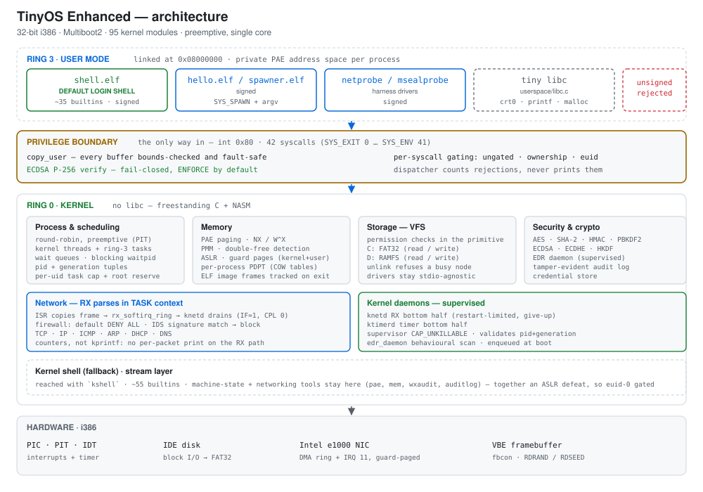

# TinyOS Enhanced

A from-scratch, security-focused **32-bit (i386) operating system kernel**, written in C and x86 assembly. Boots via Multiboot2/GRUB, runs in QEMU, and demonstrates a full vertical slice of OS concepts — protected mode, PAE paging with NX/W^X, preemptive multitasking, ring-3 user processes, a TCP/IP stack on a real NIC driver, from-scratch cryptography, and **ECDSA-signed-ELF secure boot enforced by default**.

> Successor to [douglasmun/TinyOS](https://github.com/douglasmun/TinyOS) — substantially expanded in scope, security, and reliability.

---

## Architecture

<p align="center">
  <picture>
    <source media="(prefers-color-scheme: dark)" srcset="doc/img/architecture-dark.svg">
    
  </picture>
</p>

Everything a user process can ask of the kernel goes through one gate: `int 0x80`. Buffers crossing it are validated by `copy_user`, and **no ELF is loaded until its ECDSA P-256 signature verifies** — fail-closed, so an unsigned or tampered binary is rejected at that boundary rather than partway through loading.

---

## What it does (verified working)

- **Boot → shell → login** — Multiboot2 boot, first-boot root password setup, PBKDF2-HMAC-SHA256 (100k iterations) password hashing.
- **Ring-3 user processes** — from-scratch ELF32 loader, `int 0x80` syscall interface (42 syscalls); typing `/hello.elf` loads a signed binary, runs it in user mode, services its syscalls, and reaps it on exit.
- **Ring-3 login shell** — login lands in an unprivileged ring-3 shell (~35 builtins) that reaches the kernel only through syscalls; password prompts happen in the kernel, so the shell never holds a password. `kshell` hands over to the kernel shell for networking and security tooling.
- **Signed-ELF secure boot** — every user binary is verified against a pinned **ECDSA P-256** key; unsigned/tampered binaries are **rejected (fail-closed) by default**.
- **Shell job control & pipelines** — background jobs (`/sleeper.elf &`, `jobs`, `ps`, `kill`) with a blocking `waitpid`; I/O redirection (`>`, `>>`, `<`) and **pipelines** — concurrent in the ring-3 shell (`/producer.elf 100 | /counter.elf`, both stages spawned on a real kernel pipe), with builtins in the kernel shell (`echo hi | cat -n`). Processes can start processes via `SYS_SPAWN` with full `argv` (no `fork()` — PAE, no COW pages).
- **Memory protection** — PAE paging, **NX / W^X** enforcement, **ASLR**, kernel-stack guard pages.
- **Networking** — TCP/IP stack with **DHCP, DNS, ICMP** over a real **Intel e1000** NIC driver, plus a firewall and intrusion-detection (IDS) layer.
- **Filesystems** — a VFS layer with **FAT32** (`C:`) and **RAMFS** (`D:`) drives; `ls`, file read/write, directories, Unix permission bits enforced in the filesystem primitive. In a directory you cannot list, another user's file you hold no rights on reads as absent rather than "permission denied".
- **Security monitoring** — a behavioral **EDR** subsystem (memory/network/crypto/FIM signals).
- **From-scratch crypto** — AES, SHA-256/512, HMAC, PBKDF2, ECDSA P-256, ECDHE, HKDF, ChaCha20 CSPRNG seeded from hardware RNG (RDRAND/RDSEED) + multi-source entropy.

~62K lines of kernel C across 78 translation units, plus x86 assembly and ~5.6K lines of signed userspace. Builds clean under `-Werror` with an aggressive warning set.

---

## Run it in your browser (no install)

You can boot TinyOS Enhanced **right in your browser** — it runs on the [v86](https://github.com/copy/v86) x86-to-WebAssembly emulator, so the whole PC is emulated in the tab and nothing leaves your machine:

### 👉 [**douglasmun.github.io/TinyOS_enhanced**](https://douglasmun.github.io/TinyOS_enhanced/)

Press **Start**, click the console, and set a root password; then try `help`, `ls D:`, and `/hello.elf`. Crypto (PBKDF2 100k, bit-serial ECDSA) is slow under the emulator's JIT, so first boot and the first program launch take a little while — a speed cost, not a fault. Limitations: no hard disk (drive **C:** unavailable; **D:** RAMFS works) and no networking. Source for the page is in [`web/`](web/).

## Try it in 30 seconds (prebuilt demo ISO)

A prebuilt, bootable **demo ISO** is published on the [**Releases**](../../releases) page so you can try TinyOS Enhanced without setting up a cross-toolchain. Just QEMU.

**Verify the download (recommended).** The ISO is signed with [minisign](https://jedisct1.github.io/minisign/). Grab `tinyos.iso` and `tinyos.iso.minisig` from the release, then:

```sh
minisign -Vm tinyos.iso -P RWSjOIBH4PaSwMQGL52OOQP7tyEu2p3Z83If58oyBxuatlkOnuBo2qOF
```

The release-signing public key is published **here in the README** (and in the release notes) so you can obtain it independently of the asset:

```
RWSjOIBH4PaSwMQGL52OOQP7tyEu2p3Z83If58oyBxuatlkOnuBo2qOF
```

A plain SHA-256 is also given in the [release notes](../../releases/tag/v3.0) for a quick integrity check. Either way, this is an educational OS — only run it in a throwaway VM.

**Recommended — with a virtual NIC (DHCP completes immediately):**

```sh
qemu-system-i386 -cpu Broadwell,+rdrand,+rdseed -cdrom tinyos.iso -m 256M \
  -netdev user,id=net0 -device e1000,netdev=net0
```

The kernel runs DHCP at boot. With the e1000 NIC attached (above), it gets a lease right away via QEMU's user-mode network (an address in the `10.0.2.x` NAT range) and drops to the shell promptly — this gives full outbound networking (type `kshell`, then `curl http://example.com`). Getting an address on your real home-router subnet (`192.168.0.x`) needs *bridged* networking, which on macOS only works over wired Ethernet, not Wi-Fi — see the [User Guide](doc/USER_GUIDE.md#5-networking--what-to-expect).

**Minimal — no network:**

```sh
qemu-system-i386 -cpu Broadwell,+rdrand,+rdseed -cdrom tinyos.iso -m 256M
```

> Without a NIC, the boot pauses for ~30 seconds on `[NET] DHCP: Waiting for IP address...` before timing out and continuing to the shell — that wait is expected, not a hang. Use the recommended command to skip it.

On first boot it asks you to set a root password, then drops to the ring-3 shell. Try `ls`, `ls C:`, `ls D:`, and `/hello.elf`; `kshell` switches to the kernel shell (networking, `secstatus`, `ifconfig`). For a walkthrough of boot, login, the shell commands, and networking, see the **[User Guide](doc/USER_GUIDE.md)**.

> **About the demo ISO — please read:**
> - It is an **educational demo image**, not a production system. Run it in a VM/QEMU only.
> - It contains the kernel plus signed user binaries (the ring-3 shell, `hello.elf` and the sample programs) and the **public** ECDSA verification key — **no private keys**. ELF signature enforcement is on by default.
> - It is provided for convenience; for anything beyond trying it out, build from source below so you can read exactly what you're running.

## Build & run

**Toolchain:** an `i686-elf` cross-compiler (`i686-elf-gcc`), `nasm`, `xorriso`, and `qemu-system-i386`.

```sh
# Build the kernel (warning-clean under -Werror)
make -j8 kernel.elf

# Build a bootable ISO
cp kernel.elf iso/boot/kernel.elf
i686-elf-grub-mkrescue -o dist/tinyos.iso iso     # needs xorriso

# Run headless (serial -> log file)
qemu-system-i386 -cpu Broadwell,+rdrand,+rdseed \
  -cdrom dist/tinyos.iso -boot d -m 256M \
  -netdev user,id=net0 -device e1000,netdev=net0 \
  -serial file:serial.log -display none

# Or use the smoke-test harness (GUI, captures serial + verdict)
./verify/verify-exec.sh

# Fully automated equivalent (headless; scripts first boot -> login -> exec)
./verify/auto-verify-exec.sh
```

The `verify/` folder holds ~100 such harnesses, one per invariant this project
has had to defend. Each is standalone, prints its own `RESULT:` verdict, and can
be run from anywhere — they locate the repo root themselves.

On first boot you set a root password, then log in. Try `ls`, `ls C:`, `ls D:`, and `/hello.elf`.

> **Signature enforcement:** the build enforces ELF signatures by default (fail-closed). The bundled userspace binaries (the ring-3 shell, `hello.elf`, the samples and harness probes) are signed with the pinned key, so a normal build boots and runs them. For fast local dev that accepts running unsigned binaries, build with `-DELF_PERMISSIVE_SIGNATURES` (warn-and-load) — an explicitly named opt-out, never the default.

---

## Project layout

```
src/        kernel C + assembly (memory, scheduler, syscalls, net, fs, crypto, EDR, shell)
userspace/  ring-3 shell, tiny libc, sample programs and harness probes (all signed)
tools/      build helpers (ELF signing, embedded-array generation, QEMU typist)
verify/     ~100 QEMU harnesses, one per invariant, each printing a RESULT: verdict
fuzz/       libFuzzer targets that run the real kernel sources under ASan/UBSan
doc/        design notes, security audits, and the OS comparison/grade
web/        the in-browser (v86) demo page
iso/        GRUB boot config
```

Deeper documentation lives in [`doc/`](doc/) — start with [`doc/USER_GUIDE.md`](doc/USER_GUIDE.md) (boot, login, shell, networking) and [`doc/FIREWALL_AND_IDS_CONFIG.md`](doc/FIREWALL_AND_IDS_CONFIG.md) (configuring the firewall and IDS), then `doc/SECURITY_HARDENING.md` (the security mechanisms), `doc/OS_COMPARISON_AND_GRADE.md` (where this kernel sits vs. xv6 / ToaruOS / SerenityOS and real-world tiny OSes), and `doc/SECURITY_AUDIT_2026-08.md` / `doc/FUZZ_REPORT_2026-10.md` (the latest audit and fuzz campaign).

---

## Notable engineering

- **Fail-closed signed-ELF secure boot** with key pinning — uncommon even among larger hobby OSes.
- Survived an aggressive whole-kernel security review (memory safety, integer/locking/privilege-boundary, page-table correctness) with the findings fixed and adversarially re-audited.
- Clean `-Werror` build with header-dependency tracking, gated in CI; ~100 invariant harnesses in `verify/` — a fix's harness is run against the unfixed tree first and must FAIL there; libFuzzer targets over the network parsers, FAT32, ELF verification, RAMFS and the shell parsers.

## Known limitations

- Single-core, 32-bit, console-only; targets QEMU (256 MB).
- Ring-3 pipelines are concurrent but take **programs only, one `|`** — a builtin runs inside the shell, which cannot be both stages. The kernel shell's pipelines accept builtins but run **sequentially**: a stage is fully drained before the next runs, and output beyond the 4 KB pipe buffer is truncated (reported, with `-EPIPE`).
- No long-soak / multi-day stability testing yet.
- A formerly-present SSH server was **removed** (it never completed a reliable handshake); it is not part of this repository.

---

## License

MIT License — see [`LICENSE`](LICENSE). An educational/hobby project; provided
as-is with no warranty.
